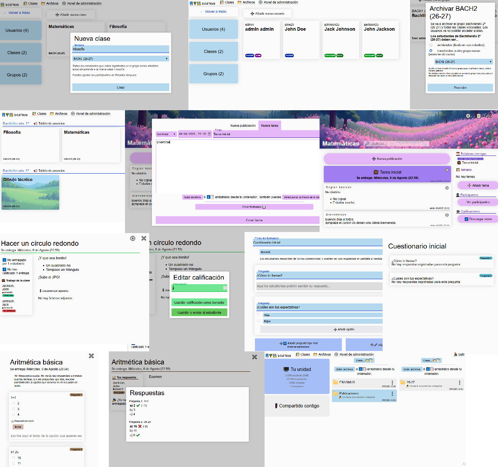

## 📘🌴🏖️ EduPlaya

Plataforma educativa de código abierto de filosofía minimalista:

- Crea y edita grupos, clases y usuarios
- Permite a tus profesores gestionar sus clases: Participantes, publicaciones, tareas, entregas, calificaciones...
- Espacio de almacenamiento: Gestiona tus archivos y compártelos
- Formularios autoevaluables

`EduPlaya` es una sencilla y robusta alternativa a _Google Classroom, Drive y Forms_, que te permite alojar los datos en tus propios servidores. ¡Deja de tener pesadillas sobre protección de datos!

### Una imagen vale más que mil palabras...



### ¿Cómo probar `EduPlaya`?

Para hacer una prueba rápida necesitarás:

* [NodeJS](https://nodejs.org/en/download)
* [Python](https://www.python.org/downloads/) y [Django](https://docs.djangoproject.com/en/5.2/topics/install/) `(pip install django)`
* Librerías `requests`, `bcrypt` y `secrets` (puedes instalarlas con `pip install`)
* Preferentemente, entorno Windows (el _script_ de arranque es `start.bat`)

Con todo ello, _clona_ (`git clone`) este repositorio y ejecuta `start.bat`:

```
C:\Users\You\eduplaya>start.bat
It seems that it's your first time running the EduPlaya. Welcome.
I will create the SQLite backend databases and perform npm install in the frontend folder
Then I will exit and you can try again - let's begin
Presione una tecla para continuar . . .
```

El _script_ se encargará de hacer las configuraciones iniciales y generar un usuario `admin` con contraseña `admin`.

Lanza otra vez el _script_ y escoge `1`:

```
C:\Users\You\eduplaya>start.bat
1) Start development servers on local machine
2) Build web applications for deployment
3) Exit
---
What do you want? 1
```

Se desplegarán varias ventanas para cada servidor de EduPlaya. Lee [doc/deployment.md](doc/deployment.md) para más información.

¡Ya puedes probar EduPlaya!

### Tecnologías

- [React](https://react.dev/)
- [Django](https://www.djangoproject.com/)

### ¿Mobile-friendly?

**¡Sí!** :smiley:

### Idiomas soportados

- Español (🇪🇸)

