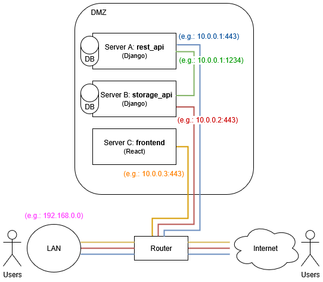

`EduPlaya` intended deployment strategy consists on manually installing different web applications onto 3 servers. The idea is that this is sufficient for most use cases and can adapt quite well to a reasonably high number of users.

There are 4 web applications to be built and deployed in 3 physically distinct servers, which are:

* `code/backend/storage_api`: Simple Django project that will save and serve users' documents.
* `code/backend/rest_api/edu_rest_public`: Django REST API that process all of the important user requests (get my classes, create assignment, move folder, etc.)
* `code/backend/rest_api/edu_rest_internal`: Simple Django project to be run in the same machine as the `edu_rest_public`. It will read its database. This API acts as an internal facade consumed by `storage_api` to _asses user quota_, _check files permissions_ and _complete login flow_. You can read more in (auth_flow.md)[auth_flow.md) and (documents_flows.md)[documents_flows.md].
* `code/frontend`: React application that will consume both `edu_rest_public` and `storage_api`.

Visually:



With that in mind, you will find in here non-comprehensive guidelines on how to deploy EduPlaya.

1. Get 3 physical machines and install an appropriate operating system on them, like [Ubuntu Server](https://ubuntu.com/download/server)

2. Connect them to your router and assign static IPs to their interfaces, like the ones shown in the picture. Note that the `rest_api` server doesn't need to have an extra physical interface for the internal API. It's good enough if that is just served on a different port - meaning that in the drawing, the _green line_ would actually go through the router

3. Install `apache2` on each machine

4. According to the [create-react-app deployment guide](https://create-react-app.dev/docs/deployment/#serving-apps-with-client-side-routing) and given that we use the `react-router` library, in the `frontend` machine Apache's server site configuration file (e.g. `/etc/apache2/sites-available/000-default.conf`) we need to add the following in order to make non-main (`/`) routes be also served properly:

```
<Directory /var/www/html>
  FallbackResource /index.html
</Directory>
```

5. In the Django machines (`storage_api` and `rest_api`) you'll need to `apt install python3-django` and [follow the steps to install `mod_wsgi`](https://modwsgi.readthedocs.io/en/develop/user-guides/quick-installation-guide.html). This can be troublesome, good luck :wink: Anyway, don't forget to `sudo a2enmod wsgi` in the end.

6. In the Django machines you will also [follow the steps to configure Apache with a Django application](https://docs.djangoproject.com/en/5.1/howto/deployment/wsgi/modwsgi/) bearing in mind that the `rest_api` server will have [two separate](https://www.blopig.com/blog/2021/05/hosting-multiple-flask-apps-using-apache-mod_wsgi/) facades.

7. Don't forget to generate SSL certificates and configure the firewall for all three public interfaces!

8. The communication between your `storage_api` and your `edu_rest_internal` can't be spied on given that you have your router and DMZ properly configured, but still we support an additional security layer with a self-signed certificate. You can (1) generate a self-signed certificate in `edu_rest_internal`, (2) configure it to use it, (3) safely copy the certificate with the public key to the `storage_api` machine's hard drive and (4) specify (during build time) where such public key is located inside `storage_api` and can therefore be used for the internal requests.

9. Now it's probably the time for you to _build_ the 4 web applications. In your development machine you can `start.bat` and select `2`. You will be prompted a few questions like the IPs or domain names where your servers are accessible.

10. When the EduPlaya build process is finished, you can copy the result to each machine and unzip the built apps in the location you have specified in the Apache sites config files for each machine. Well done!

11. A very nice extra step is to properly configure the Linux permissions for the _database_ files (and containing folder) in both `storage_api` and `rest_api`. For example, if you have your server files under `/var/www/edu_rest/` for the `rest_api`, you should:

```
sudo chown www-data /var/www/edu_rest/database
sudo chown www-data /var/www/edu_rest/database/db.sqlite3
sudo chmod 600 /var/www/edu_rest/database/db.sqlite3
```

12. Don't forget also to set proper permissions for any certificate private keys and properly configure the router redirections and firewall according to your needs.

13. Enjoy your totally-DIY-built educational alternative!